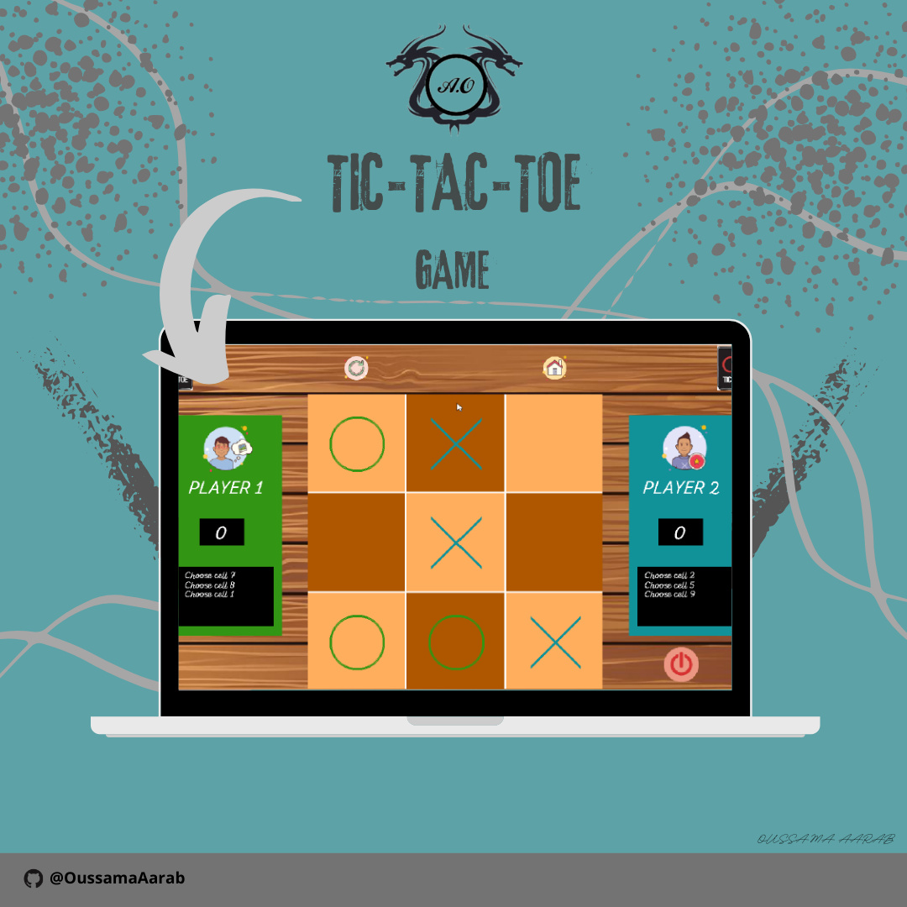
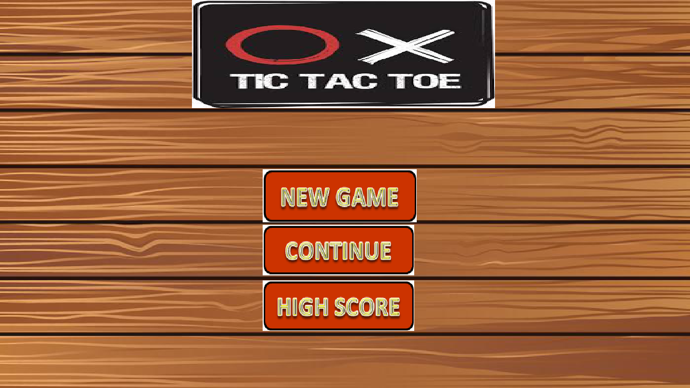
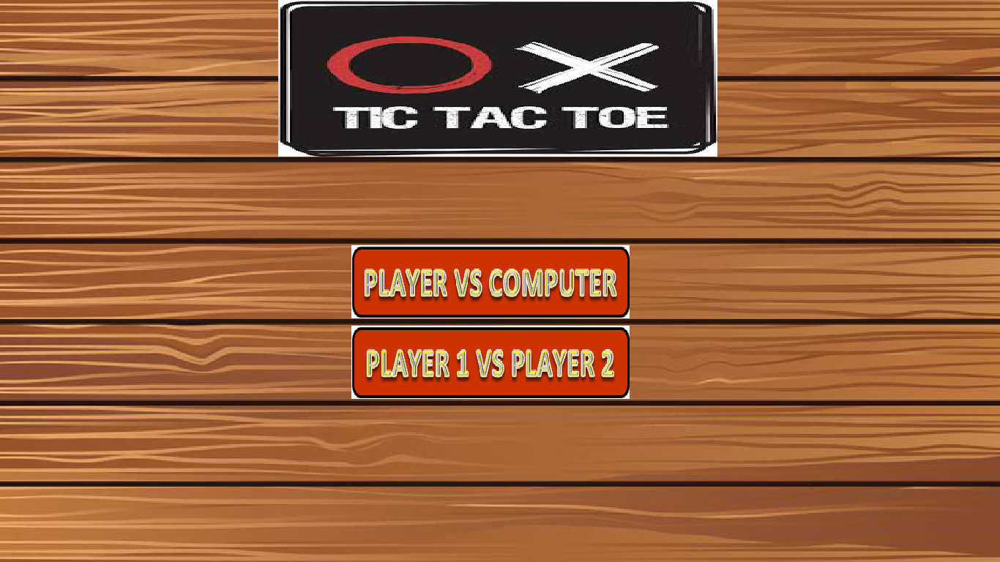
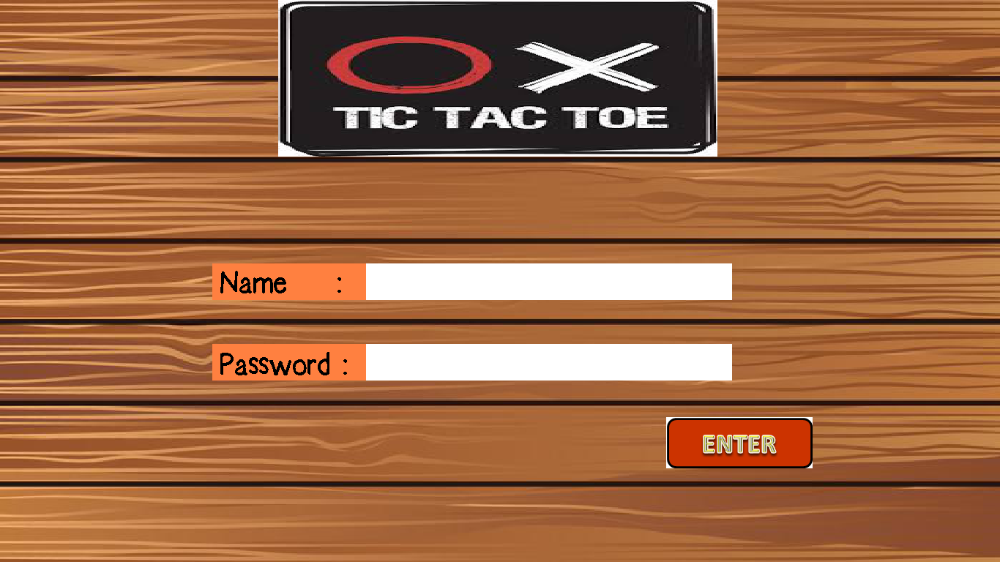
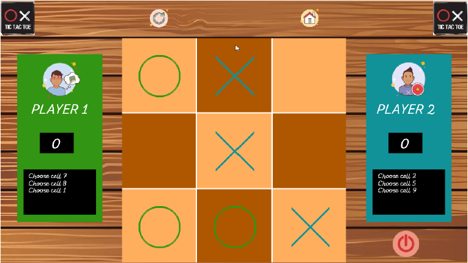
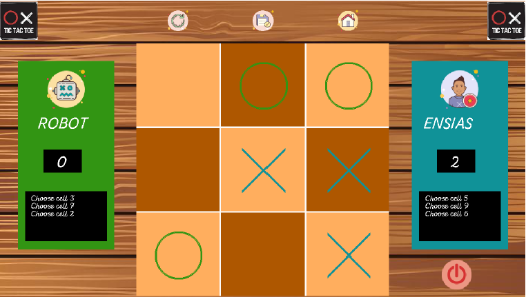

# :video_game: Tic-Tac-Toe
Source codes of the TicTacToe game using C

  

# :memo: Description

  

<strong>Tic-Tac-Toe</strong> is a puzzle game that is practiced with two players in turn whose goal is to create the first alignment. There are two mode of play either a human against the computer by choosing the desired difficulty or a human against another human. For the mode against the computer, during the game, a player confronts the artificial intelligence of the program (Min/Max method) which is designed to play without ever making mistakes. The screen is divided into nine numbered boxes. The player indicates his choice by clicking on the desired box, the computer plays his turn and so on. The winner is the one who manages to line up three identical symbols horizontally, vertically or diagonally.

# :camera: Screenshots

### :house: Home

  

  &nbsp;&nbsp;&nbsp;
  

  

### :boy:Player1 :vs: :boy:Player2

  

### :boy:Player :vs: :computer:Computer

  

# :dart: Prerequisites
Install MinGW
Install GnuWin for Windows to execute the Make file

# :gear: Program execution
You just have to open the terminal in the file location and run the MakeFile file by typing <code>make</code>
